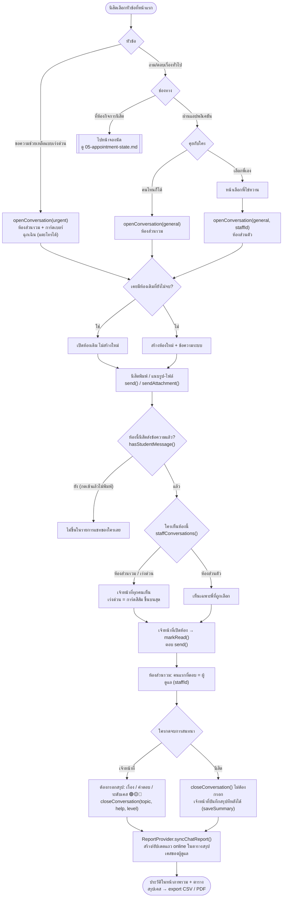
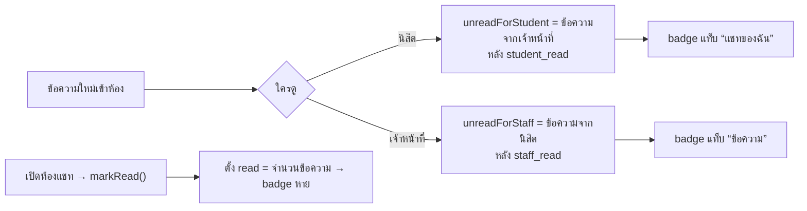

# 4. Flowchart แชท (ทัก → ตอบ → จบ → ตารางสรุปเคส)

ไฟล์หลัก: `lib/providers/chat_provider.dart`, `lib/screens/chat/`, `lib/providers/report_provider.dart`

```mermaid
flowchart TD
  A([นิสิตเลือกหัวข้อที่หน้าแรก]) --> B{หัวข้อ}
  B -- "ขอความช่วยเหลือแบบเร่งด่วน" --> U["openConversation(urgent)<br/>ห้องส่วนรวม + การ์ดเบอร์ฉุกเฉิน (แตะโทรได้)"]
  B -- "ถาม/ตอบเรื่องทั่วไป" --> C{ช่องทาง}
  C -- "ที่ห้องกิจการนิสิต" --> APPT[[ไปหน้าจองนัด<br/>ดู 05-appointment-state.md]]
  C -- "ผ่านแอปพลิเคชัน" --> D{คุยกับใคร}
  D -- "คนไหนก็ได้" --> G["openConversation(general)<br/>ห้องส่วนรวม"]
  D -- "เลือกพี่เอง" --> SP["หน้าเลือกพี่ไข่หวาน"] --> S1["openConversation(general, staffId)<br/>ห้องส่วนตัว"]

  U & G & S1 --> E{เคยมีห้องเดิมที่ยังไม่จบ?}
  E -- ใช่ --> E1[เปิดห้องเดิม ไม่สร้างใหม่]
  E -- ไม่ --> E2[สร้างห้องใหม่ + ข้อความระบบ]
  E1 & E2 --> F["นิสิตพิมพ์ / แนบรูป-ไฟล์<br/>send() / sendAttachment()"]

  F --> V{"ห้องนี้นิสิตส่งข้อความแล้ว?<br/>hasStudentMessage()"}
  V -- "ยัง (กดเข้าแล้วไม่พิมพ์)" --> HID[ไม่ขึ้นในรายการแชทของใครเลย]
  V -- แล้ว --> W{"ใครเห็นห้องนี้<br/>staffConversations()"}
  W -- "ห้องส่วนรวม / เร่งด่วน" --> W1[เจ้าหน้าที่ทุกคนเห็น<br/>เร่งด่วน = การ์ดสีส้ม ขึ้นบนสุด]
  W -- ห้องส่วนตัว --> W2[เห็นเฉพาะพี่ที่ถูกเลือก]

  W1 & W2 --> R["เจ้าหน้าที่เปิดห้อง → markRead()<br/>ตอบ send()"]
  R --> R1["ห้องส่วนรวม: คนแรกที่ตอบ = ผู้ดูแล (staffId)"]
  R1 --> X{ใครกดจบการสนทนา}
  X -- เจ้าหน้าที่ --> X1["ต้องกรอกสรุป: เรื่อง / คำตอบ / ระดับเคส 🟢🟡🔴<br/>closeConversation(topic, help, level)"]
  X -- นิสิต --> X2["closeConversation() ไม่ต้องกรอก<br/>เจ้าหน้าที่บันทึกสรุปทีหลังได้ (saveSummary)"]
  X1 & X2 --> Y["ReportProvider.syncChatReport()<br/>สร้าง/อัปเดตแถว online ในตารางสรุปเคสของผู้ดูแล"]
  Y --> Z([ประวัติในหน้าภาพรวม + ตารางสรุปเคส → export CSV / PDF])
```

## ตัวเลข "ยังไม่อ่าน"

```mermaid
flowchart LR
  M[ข้อความใหม่เข้าห้อง] --> N{ใครดู}
  N -- นิสิต --> N1["unreadForStudent = ข้อความจากเจ้าหน้าที่<br/>หลัง student_read"]
  N -- เจ้าหน้าที่ --> N2["unreadForStaff = ข้อความจากนิสิต<br/>หลัง staff_read"]
  N1 --> B1[badge แท็บ “แชทของฉัน”]
  N2 --> B2[badge แท็บ “ข้อความ”]
  O["เปิดห้องแชท → markRead()"] --> P[ตั้ง read = จำนวนข้อความ → badge หาย]
```
